**English** | [简体中文](README.md)

<picture>
  <source media="(max-width: 640px) and (prefers-color-scheme: dark)" srcset="assets/presentation/hero-mobile-dark.svg">
  <source media="(max-width: 640px)" srcset="assets/presentation/hero-mobile-light.svg">
  <source media="(prefers-color-scheme: dark)" srcset="assets/presentation/hero-dark.svg">
  
</picture>

**Save cover style, model parameters and title layout in a lockable style pack, then generate and inspect a consistent cover set.**

`v0.5.0` · `Python 3.12+` · [Apache-2.0](LICENSE)

[Website](https://coverlock.lei6393.com) · [Demo record](docs/demo-results.json)

## Why use it

Cover batches require repeated decisions about image style, title layout and canvas dimensions. CoverLock keeps those choices in a YAML style pack, reuses its locked settings, and records size and title bounds in sidecars for gallery inspection.

## Architecture

<picture>
  <source media="(max-width: 640px) and (prefers-color-scheme: dark)" srcset="assets/presentation/architecture-mobile-dark.svg">
  <source media="(max-width: 640px)" srcset="assets/presentation/architecture-mobile-light.svg">
  <source media="(prefers-color-scheme: dark)" srcset="assets/presentation/architecture-dark.svg">
  
</picture>

stylepack.py owns YAML and lock hashes. Model adapters create text-free visuals; compose.py places titles using dimensions and safe zones from rules.py. gallery.py builds a contact sheet from recorded compose-time checks. Model quality and local layout checks are separate concerns.

Platform rules are in [assets/rules](assets/rules/), with a [sample pack](assets/stylepacks/example.yaml). v0.5.0 verifies the original pack lock before applying a model override.

## Install

Requires Python 3.12+. Installation needs network access; the demo uses the built-in mock without model credentials.

```bash
git clone https://github.com/SuperMarioYL/coverlock.git
cd coverlock
python3 -m venv .venv
source .venv/bin/activate
python -m pip install -e .
```

## Quickstart

The real three-cover offline mock run exercises locking, composition, one-cover regeneration and gallery creation. The 3/3 result is a local geometry check for these inputs, not model-quality or platform-acceptance evidence.

```bash
python -m coverlock.cli lock examples/presentation-pack.yaml
python -m coverlock.cli gen --pack examples/presentation-pack.yaml --titles examples/presentation-titles.txt --out examples/presentation-output
python -m coverlock.cli regen --pack examples/presentation-pack.yaml --out examples/presentation-output --index 2 --title "Read something new"
python -m coverlock.cli gallery --out examples/presentation-output
```

Inputs are the [locked pack](examples/presentation-pack.yaml) and [three titles](examples/presentation-titles.txt). Use the [replay script](examples/presentation_demo.sh); the result is [gallery.png](examples/presentation-output/gallery.png).

## Usage

init creates a draft, lock freezes fields, gen renders a set, regen --index N redraws one cover, and gallery builds a contact sheet. A supplied pack requires a valid lock by default. After evolving and relocking a style, regenerate the whole set to avoid mixed styles.

## Recorded demo

<picture>
  <source media="(max-width: 640px) and (prefers-color-scheme: dark)" srcset="assets/presentation/process-mobile-dark.svg">
  <source media="(max-width: 640px)" srcset="assets/presentation/process-mobile-light.svg">
  <source media="(prefers-color-scheme: dark)" srcset="assets/presentation/process-dark.svg">
  
</picture>

### Lock the style

Compute and store the example pack lock.

```text
$ python -m coverlock.cli lock examples/presentation-pack.yaml
locked examples/presentation-pack.yaml
locked_sha: f3dab7a4a2c7cc0cdb3aad0575d091dd5a2c061621497f26e44876c966a8b4a6
the style is now frozen; any edit to a locked field will be detected.
```

### Generate three covers

The built-in mock generates three covers with 3/3 size and title checks.

```text
$ python -m coverlock.cli gen --pack examples/presentation-pack.yaml --titles examples/presentation-titles.txt --out examples/presentation-output
coverlock gen · pack=presentation (locked) · model=mock · size=4:5 (1080x1350) · 3 title(s)
  [✓] cover_01.png  1080x1350  size=✓ safe-zone=✓
  [✓] cover_02.png  1080x1350  size=✓ safe-zone=✓
  [✓] cover_03.png  1080x1350  size=✓ safe-zone=✓
done · size-compliant 3/3 · titles-in-safe-zone 3/3 · out=examples/presentation-output
```

### Regenerate cover two

The second cover receives a new title.

```text
$ python -m coverlock.cli regen --pack examples/presentation-pack.yaml --out examples/presentation-output --index 2 --title "Read something new"
regenerated cover 02 → examples/presentation-output/cover_02.png (same locked pack; other covers untouched)
```

### Inspect the set

Gallery summarizes the recorded local composition checks.

```text
$ python -m coverlock.cli gallery --out examples/presentation-output
gallery → examples/presentation-output/gallery.png
size-compliant 3/3 · titles-in-safe-zone 3/3
```

## Capabilities and integration

<picture>
  <source media="(max-width: 640px) and (prefers-color-scheme: dark)" srcset="assets/presentation/integrations-mobile-dark.svg">
  <source media="(max-width: 640px)" srcset="assets/presentation/integrations-mobile-light.svg">
  <source media="(prefers-color-scheme: dark)" srcset="assets/presentation/integrations-dark.svg">
  
</picture>

File inputs and local composition work offline; remote models supply only the base image. Use models and rules to inspect available routes. Gallery reads recorded title bounds from composition rather than judging only canvas size.


## Configuration

Rules define 1080×1350 for 4:5 and 1080×1440 for 3:4, with title safe zones. --size selects dimensions and --out selects the output directory. The pack locks model, prompt scaffold, palette and layout. Optional remote backends need API credentials. Oversized titles can fail safe-zone checks, which the CLI and gallery report.

## Roadmap and scope

The local CLI, locking, single-cover regeneration, three backend routes and gallery are implemented. More platforms, typography controls and hosted collaboration remain future directions; automatic posting and hosted plans are not available.

- Mock visuals are offline fixtures, not evidence of Doubao or Qwen image quality.
- Safe-zone checks follow repository rules; they do not guarantee platform acceptance or fit for every title.
- The tool does not publish content automatically or provide a live hosted plan.

## License

[Apache-2.0](LICENSE)
