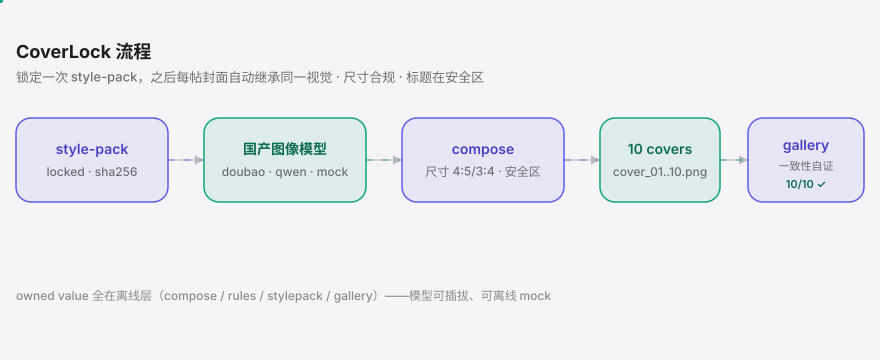

<div align="right"><sub><b>中文</b>&nbsp;&nbsp;⇄&nbsp;&nbsp;<a href="./README.en.md">English</a></sub></div>

<picture>
  <source media="(prefers-color-scheme: dark)" srcset="./assets/hero-dark.svg">
  <source media="(prefers-color-scheme: light)" srcset="./assets/hero-light.svg">
  
</picture>

<p><sub>CoverLock 是给小红书图文创作者的封面套图 Skill：一次锁定账号级 style-pack，之后每帖封面自动继承同一视觉、尺寸永远合规、标题永远落在安全区，还能保留风格只重绘单张。核心自证是一套 locked style-pack 连出 10 张封面的一致性 gallery。</sub></p>

<p align="center">
  <a href="./LICENSE"></a>
  
  
  <a href="https://github.com/SuperMarioYL/coverlock/actions/workflows/ci.yml"></a>
  
  
</p>

CoverLock 不是又一个「一句 prompt 出一张图」的文生图盒子。它把**一套账号视觉语言**固化成一个可 `lock`、可复用、可分享的 **style-pack** 资产：锁定之后，`gen` / `regen` 全程复用同一 `model + prompt 脚手架 + palette + layout`，让同一账号跨帖、跨天的封面收敛到同一视觉——和归藏（op7418）的 social-covers Skill 同赛道，但把小红书封面这一具名 surface 往前推了一步：**账号级风格锁定 + 4:5 / 3:4 尺寸强制 + 标题安全区强制**。

出图交给你自带 key 的国产图像模型（豆包 Seedream / 阿里 Qwen-Image），也内置一个零 key、离线、确定性的 `mock` 模型——`install → gallery` 无需任何 key、无需联网即可跑通全链路。

<h2> 架构</h2>

<picture>
  <source media="(prefers-color-scheme: dark)" srcset="./assets/atlas-dark.svg">
  <source media="(prefers-color-scheme: light)" srcset="./assets/atlas-light.svg">
  
</picture>

单进程 CLI，无服务、无数据库，全部本地运行。**owned value 全在离线层**（`compose` / `rules` / `stylepack` / `gallery`）——尺寸合规、标题安全区、style-pack 锁定都不依赖任何具体模型，即使模型 API 涨价 / 下线 / 换供应商也照常工作；模型只负责出「无文字的主视觉」，是可插拔的外围。平台尺寸 / 安全区规则做成外部 YAML（`assets/rules/xiaohongshu.yaml`），改规则只改配置、不改代码。

<h2> 安装</h2>

```bash
pip install coverlock
```

要求 Python 3.12+。从源码安装：`git clone … && cd coverlock && pip install -e .`。

<h2> 快速开始</h2>

三条命令，零 key、离线，从安装到那张一致性 gallery：

```bash
coverlock init my-pack --desc "极简杂志风、莫兰迪色、大留白"   # 生成 my-pack.yaml 草稿
coverlock gen --pack my-pack.yaml --titles titles.txt --model mock  # 连出一套竖版封面
coverlock gallery --out out                                    # 拼出 10 张一致性 gallery
```

`titles.txt` 一行一个标题（`#` 开头为注释）。`--model mock` 让整条链路无需任何 API key、无需联网即可跑通；换成 `--model doubao` / `--model qwen` 并 `export` 对应的 key，即用国产模型出真图。

<h2> 用法</h2>

完整的 `init → lock → gen → regen → gallery` 在环控制闭环：

**1. 锁定风格（style-pack 冻结）**

```bash
coverlock init my-pack --desc "极简杂志风、莫兰迪色、大留白"
coverlock lock my-pack.yaml       # 校验 schema + 写入 locked_sha，风格自此冻结
```

`lock` 用 sha256 对 `model + prompt 脚手架 + palette + layout` 求值并落盘。此后任何对锁定字段的改动都会被检测到。

**2. 连出一套封面**

```bash
export DOUBAO_API_KEY=...                       # 自带 key（离线可跳过，用 --model mock）
coverlock gen --pack my-pack.yaml --titles titles.txt
# out/cover_01.png … cover_10.png
# 每张 4:5 或 3:4 尺寸 100% 合规、标题 100% 落在安全区（超界自动缩字号 / 换行，绝不裁字）
```

`gen` 全程只读 locked pack，并写一个 sidecar，让 `regen` / `gallery` 能重建这一整套。

**3. 保风格只重绘单张（in-the-loop）**

```bash
coverlock regen --pack my-pack.yaml --index 3 --title "换个新标题"
# 只重绘第 3 张；其余封面字节不变
```

**4. 拼出一致性 gallery（核心自证）**

```bash
coverlock gallery --out out
# out/gallery.png：10 宫格 + 每张 尺寸✓ / 安全区✓ 角标
#                  + 底部 size-compliant 10/10 · titles-in-safe-zone 10/10 自证 footer
```

**辅助命令**

```bash
coverlock models      # 列出可用模型：mock（离线，无 key）/ doubao-seedream / qwen-image
coverlock rules       # 打印当前平台规则表（尺寸 + 安全区矩形）
coverlock --version
```

<h2> Demo</h2>


`init → lock → gen`（10 张）→ `regen` 单张 → `gallery`，全程 `--model mock` 离线跑通；末尾即那张带 `size-compliant 10/10 · titles-in-safe-zone 10/10` 自证角标的一致性 gallery。

<h2> 为什么用 CoverLock</h2>

- **账号级 style-pack 是新原语**——不是无状态的「一次性 prompt → 图」（每张都漂移），而是一个可 hash-lock、可跨帖复用、可分享的 YAML 资产。taste 不再是一句抽象指令，而是一个可锁定的资产文件。
- **尺寸永远合规**——模型出图后由 PIL 强制 resize / crop 到 4:5 或 3:4，输出 100% 合规；平台改尺寸只改一个 YAML。
- **标题永远在安全区**——标题只排进 `rules` 定义的安全区矩形，超界自动缩字号 / 换行，绝不裁字、绝不压到平台自己的浮层上。
- **模型可插拔、可离线**——离线层不依赖任何单一模型；`mock` 让全链路零 key 跑通，真图交给你自带 key 的豆包 / Qwen。
- **在环控制**——`regen` 能「保留整套风格、只重绘这一张」，模板工具做不到。
- **自证一目了然**——一套 locked pack 连出 10 张的一致性 gallery，右下角合规角标 + 底部自证 footer，就是最强的截图钩子。

<h2> 配置</h2>

平台几何是唯一事实源，放在 `assets/rules/xiaohongshu.yaml`——改尺寸 / 安全区只改这个文件，不碰任何 Python：

| 尺寸 | 画布 (px) | 安全区 (x, y, w, h) |
|---|---|---|
| `4:5` | 1080 × 1350 | 96, 132, 888, 900 |
| `3:4` | 1080 × 1440 | 96, 140, 888, 980 |

坐标原点为画布左上角。安全区是标题必须完全落入的矩形，已从画布边缘内缩以避开平台顶部状态栏、底部操作栏与侧边留白。

<h2> 付费 / Pricing</h2>

CoverLock 本体是 **OSS + 自带 key，永久免费**——把工具本身开源、离线可跑，是起星与建立信任的前提。

面向**小红书代运营 / MCN** 的**托管层**（规划中，v0.2+）：他们同时管几十个账号、每天要批量出封面，且大多不想给每个账号配模型 key、不想在本地跑 CLI。托管层把「自带 key 本地跑」升级成——上传一批标题 → 云端用平台的国产模型额度连出一套合规封面 → 云端存该账号的 locked style-pack，支持多账号、多席位、协作复用同一 pack。

| 层级 | 面向 | 价格（educated guess，未上线） |
|---|---|---|
| **OSS** | 个人创作者，自带 key | 免费 · 永久开源 |
| **托管出图 + 云端 style-pack** | 中小商家 / 单账号代运营 | ¥99/月起（含 N 个 pack + M 张/月额度） |
| **团队版** | MCN / 多账号代运营 | ¥499/月（多席位 + 多账号 pack 库），超额 ¥0.3–0.5/张 |

> v0.1 不落任何付费墙，这里仅标注方向。托管层将在确认商家真实需求后上线。

<h2> 路线图</h2>

- [x] **v0.1** — 尺寸合规封面渲染 · style-pack 锁定 + 单张 regen · 10 张一致性 gallery · `mock` / 豆包 / Qwen 三模型
- [ ] 更多平台规则表（除小红书外的竖版 surface）
- [ ] 字体子集化与自定义标题字体
- [ ] 以可安装 Skill 形态进入 codex / claude-skill 生态
- [ ] 托管出图 + 云端 style-pack 存储（面向代运营 / MCN 的付费层）

## 不做的事

自动发帖 / 发布到任何平台 · 抓取小红书或他人内容 · 投流 / 涨粉 / 流量运营 · 多平台聚合分发 · 训练 / 微调图像模型 · 视频封面。CoverLock 只处理你自己的封面文件。

<p align="center"><sub><a href="./LICENSE">MIT</a> © 2026 SuperMarioYL</sub></p>
